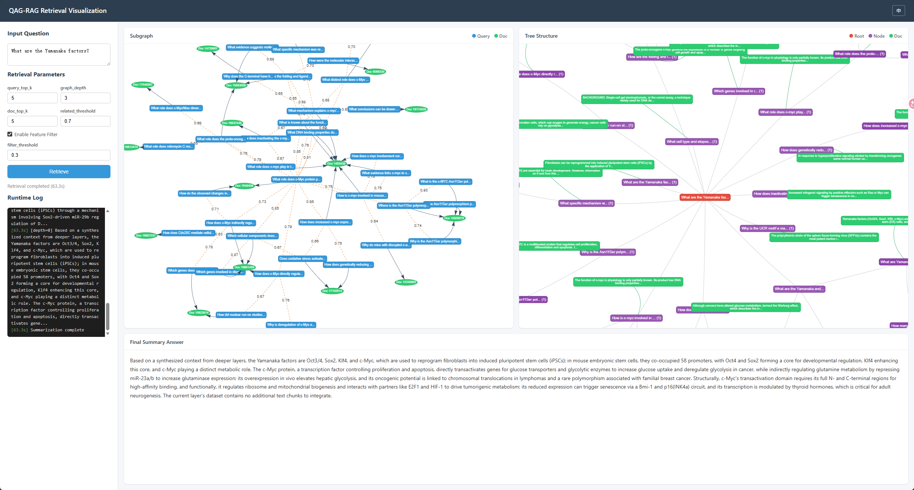

# QAG-RAG: Knowledge Graph Enhanced Retrieval-Augmented Generation

A RAG system for biomedical question answering, evaluated on the [mini-BioASQ](https://huggingface.co/datasets/rag-datasets/rag-mini-bioasq) dataset. Combines **Milvus** vector retrieval with **Neo4j** knowledge graph traversal for hybrid recall and bottom-up hierarchical summarization.

## Quick Start

### 1. Setup

```bash
# 使用 conda 创建虚拟环境（推荐）
conda create -n qag-rag python=3.12 -y
conda activate qag-rag

# 安装依赖
pip install -r requirements.txt
python -m spacy download en_core_web_sm
```

### 2. Configuration

Create a `.env` file:

```env
# LLM
LLM_PROVIDER=openai
LLM_MODEL=Pro/deepseek-ai/DeepSeek-V3.2
LLM_API_KEY=sk-xxx
LLM_BASE_URL=https://api.siliconflow.cn/v1

# Embedding
EMBEDDING_PROVIDER=openai
EMBEDDING_MODEL=Pro/BAAI/bge-m3
EMBEDDING_API_KEY=sk-xxx
EMBEDDING_BASE_URL=https://api.siliconflow.cn/v1
EMBEDDING_DIMENSION=1024

# Milvus
MILVUS_URI=http://localhost:19530
MILVUS_TOKEN=root:Milvus
MILVUS_DB_NAME=rag_mini_bioasq
MILVUS_INDEX_TYPE=IVF_FLAT

# Neo4j
NEO4J_URI=bolt://localhost:17687
NEO4J_USERNAME=neo4j
NEO4J_PASSWORD=neo4j123
```

### 3. Start Infrastructure

```bash
docker compose up -d
```

| Service | Endpoint |
|---|---|
| Neo4j (main) | HTTP `localhost:17474`, Bolt `localhost:17687` |
| Neo4j (deepseek) | HTTP `localhost:17475`, Bolt `localhost:17688` |
| Neo4j (test) | HTTP `localhost:17477`, Bolt `localhost:17690` |
| Milvus gRPC | `localhost:19530` |
| Milvus Web UI | `localhost:9091` |
| Attu (Milvus UI) | `localhost:18000` |

### 4. Load Data

Load data from a Neo4j-exported CSV into both Milvus and Neo4j:

```bash
cd qag-rag/pipelines
python load_data.py --csv ../../data/mini-bioasq_qag_deepseekv3.2.csv
```

Or skip Milvus if collections already exist:

```bash
python load_data.py --csv ../../data/mini-bioasq_qag_deepseekv3.2.csv --skip-milvus
```

### 5. Build Knowledge Graph (alternative)

Build the graph from existing Milvus data:

```bash
cd qag-rag/pipelines
python build_graph.py
```

> Supports checkpoint resumption via the `skip_batches` parameter.

### 6. Run Retrieval Tests

```bash
cd qag-rag/pipelines
python test/test_qag_retrieval.py
```

### 7. QAG Retrieval Pipeline

Run the full subgraph retrieval with hierarchical summarization:

```bash
cd qag-rag/pipelines
python qag_retrieval.py -q "What is cystic fibrosis?"
```

### 8. Web UI

```bash
cd qag-rag/webui
python app.py
```

Open `http://localhost:8000` for the interactive visualization of the retrieved subgraph, tree structure, and final answer.



## Project Structure

```
.
├── qag-rag/
│   ├── config.py                 # Config dataclasses (LLM / Embedding / Milvus / Neo4j / Retrieval)
│   ├── core/
│   │   ├── llm_provider.py       # LLM abstraction: OllamaProvider + OpenAIProvider
│   │   ├── prompt.py             # Prompt templates and separator constants
│   │   ├── retrieval.py          # Milvus + Neo4j hybrid retrieval engine
│   │   ├── reranker.py           # Entity-aware two-stage reranker
│   │   ├── utils.py              # Utilities: embedding / query generation / entity extraction
│   │   └── generate_queries.py   # Corpus to Milvus query ingestion pipeline
│   ├── pipelines/
│   │   ├── config.yml            # Default retrieval parameters
│   │   ├── build_graph.py        # Milvus to Neo4j knowledge graph builder
│   │   ├── load_data.py          # CSV to Milvus + Neo4j data loading pipeline
│   │   ├── qag_retrieval.py      # Full retrieval pipeline: subgraph, filter, tree, summarize
│   │   ├── qag_response.py       # (reserved)
│   │   └── test/
│   │       └── test_qag_retrieval.py
│   ├── webui/
│   │   ├── app.py                # FastAPI backend (SSE streaming)
│   │   └── static/index.html     # vis-network.js frontend visualization
│   ├── api/                      # (reserved)
│   └── tools/                    # (reserved)
├── data/
│   ├── mini-bioasq_qag_deepseekv3.2.csv
│   ├── mini-bioasq_qag_qwen3_1.7b.csv
│   └── mini_bioasq_qag_glm_z1_9b.csv
├── docker-compose.yaml
├── bioasq_openai_qag.yaml        # Experiment configuration
└── .env                          # Environment variables (gitignored)
```

## Retrieval Strategy

### Recall Phase (`qag_recall_documents`)

| Strategy | Description |
|---|---|
| Document vector search | Milvus `chunk_collection` semantic search |
| Similar query recall | Milvus `query_collection` finds similar questions and their linked docs |
| Keyword filtering | KeyBERT keyword extraction with regex matching (disabled) |
| Graph multi-hop | Neo4j `RELATED` / `GENERATE_BY` edge traversal |

### Reranking (`EntityReranker`)

Combined score: `v3 = alpha * v1 + (1 - alpha) * v2`

- **v1** — Query-document cosine similarity
- **v2** — Entity matching score (spaCy NER + embedding cross-similarity)
- **alpha** — Default 0.5

### Hierarchical Summarization

Traverses the subgraph from leaves to root, calling the `Hierarchical_Summary` prompt at each level. Each layer's summary becomes context for the next, producing the final answer.

## Configuration Priority

`.env` environment variables > `pipelines/config.yml` > `config.py` hardcoded defaults

## Datasets

Pre-generated QAG results from three LLMs in `data/`:

| File | Model |
|---|---|
| `mini-bioasq_qag_deepseekv3.2.csv` | DeepSeek-V3.2 |
| `mini-bioasq_qag_qwen3_1.7b.csv` | Qwen3 1.7B |
| `mini_bioasq_qag_glm_z1_9b.csv` | GLM-Z1 9B |
